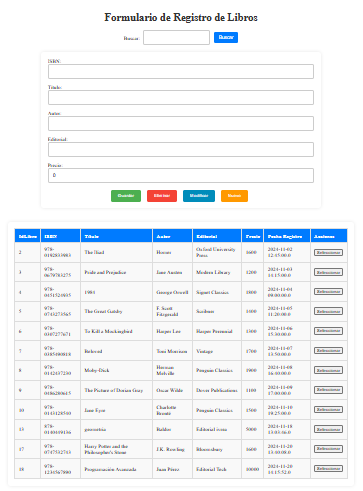
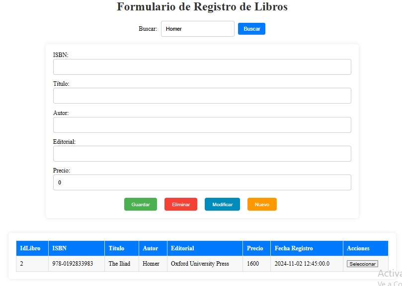
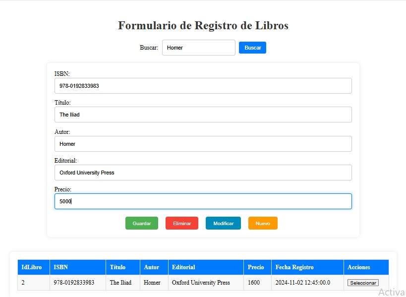

# Proyecto de Gestión de Libros

## Descripción
Este sistema web desarrollado con **Hibernate**, **MVC** y desplegado en **GlassFish 4.1** permite la gestión de libros. Proporciona una interfaz para registrar, buscar, modificar y eliminar libros.

---

## Tecnologías utilizadas
- **Java JDK 7**
- **Netbeans 8.0.2:** FEntorno de desarrollo integrado (IDE) para la creación y despliegue del proyecto.
- **Java Server Faces (JSF):** Framework para interfaces web.
- **Hibernate:** ORM para manejar la persistencia de datos.
- **GlassFish 4.1:** Servidor de aplicaciones.
- **HTML, CSS ** Para diseño y estilos.
- **MVC (Modelo-Vista-Controlador):** Arquitectura del proyecto.

---

## Capturas de pantalla

### Pantalla de Inicio

### Seccion de Busqueda

### Modificar Registros

---

## Funcionalidades principales
### Gestión de libros
1. **Registrar libro:** Completa el formulario y guarda los datos.
2. **Buscar libro:** Encuentra libros por título, autor, isbn.
3. **Modificar libro:** Actualiza detalles desde el formulario.
4. **Eliminar libro:** Remueve libros desde el sistema.
5. **Listar libros:** Muestra todos los libros registrados en una tabla.

### Validaciones
- Formularios validados para entradas correctas.
- Requisitos de campos obligatorios y formatos específicos.

---
### Futuras Mejoras
Implementar autenticación de usuarios con roles.
Añadir reportes y estadísticas sobre la información de los libros.
Integrar APIs REST para operaciones CRUD externas.
Mejorar la experiencia de usuario con componentes interactivos y mejor diseño.

